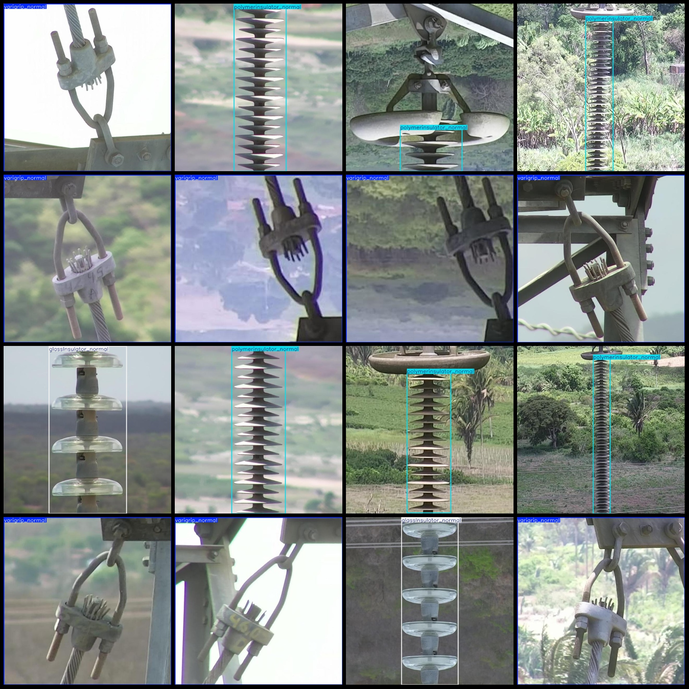
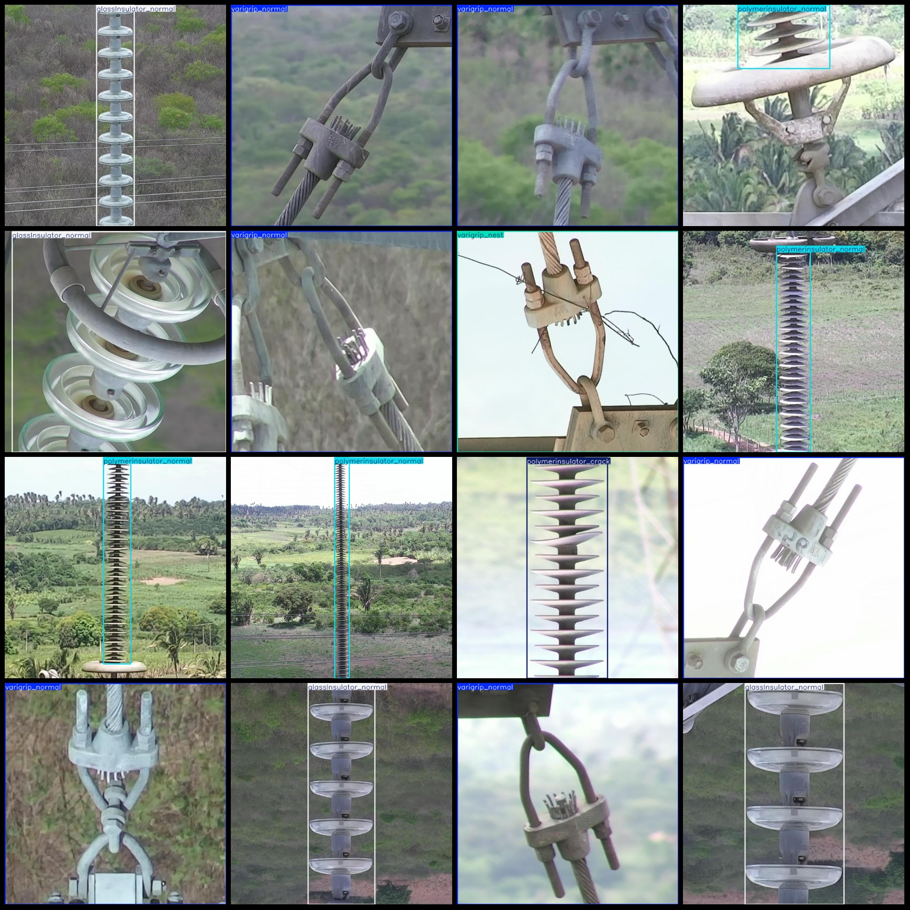

# Power Scenery Junction Box and Insulator Defect Detection Data Set - VOC+YOLO Format with 2681 Images in 7 Categories

Dataset format: Pascal VOC format + YOLO format (txt files without split paths, only containing jpg images and corresponding VOC format xml files and yolo format txt files)
Number of images (jpg file count): 2681
Number of annotations (xml file count): 2681
Number of annotations (txt file count): 2681
Number of annotation categories: 7
Annotation category names (note that the order of categories in the yolo format does not correspond to this, but is based on the labels folder classes.txt): ["glassInsulator_normal", "glassinsulator_crack", "polymerinsulator_crack", "polymerinsulator_normal", "varigrip_nest", "varigrip_normal", "varigrip_rust"]
Each category has a number of bounding boxes: 
glassInsulator_normal = 474
glassinsulator_crack = 2
polymerinsulator_crack = 47
polymerinsulator_normal = 725
varigrip_nest = 124
varigrip_normal = 1215
varigrip_rust = 104
Total bounding box count: 2691
Image resolution: 640x640
Use annotation tool: labelImg
Annotation rules: draw a rectangle around the class.
important notes: Datasets are not divided into training, validation and test sets. Please divide them yourself.
Special statement: This dataset does not guarantee the accuracy of the trained model or weight files.
Preview:
## Images

Here is a pay link on Stripe ( https://buy.stripe.com/3cs8yP7sY87d0vu9AB ). Please contact me lonlonago@foxmail.com after funding $89, and I will send you a complete data files , thank you!

